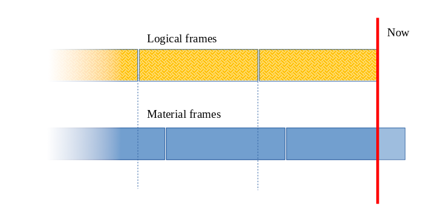

# Sliding Window Counter 📊⏱️

[](https://packagist.org/packages/sanmai/sliding-window-counter)
[](https://github.com/sanmai/sliding-window-counter/blob/master/LICENSE)

## Short-lived cache-backed time series with anomaly detection

A lightweight, efficient PHP library for tracking time-based events and detecting anomalies without the overhead of databases or logs.

## Table of Contents

- [Overview](#whats-this-all-about)
- [Features](#features)
- [How It Works](#how-it-works-the-simple-version)
- [Installation](#installation)
- [Quick Start](#quick-start)
  - [Setting up a counter](#setting-up-a-counter)
  - [Tracking events](#tracking-events)
  - [Detecting unusual activity](#detecting-unusual-activity)
  - [Getting more stats](#getting-more-stats)
- [Advanced Usage](#adjusting-sensitivity)
- [Cache Adapters](#available-cache-adapters)
- [Technical Details](#technical-details-for-the-curious)
- [Contributing](#contributing)
- [License](#license)

## Installation

```bash
composer require sanmai/sliding-window-counter
```

## What's this all about?

Ever needed to track how many times something happens over time and spot when those numbers get weird? That's what this library does, and it does it efficiently.

**Real-world example:** Imagine you want to detect when suspicious messages from specific IP ranges suddenly spike. Instead of digging through logs or querying databases (slow and resource-hungry), this library uses in-memory caching to track events and spot unusual patterns.

## Features

✅ **Lightweight** - Uses your existing cache infrastructure<br>
✅ **Fast** - No database queries or log parsing<br>
✅ **Statistical anomaly detection** - Based on standard deviations<br>
✅ **Flexible time windows** - Configure to your needs<br>
✅ **Production-ready** - Originally [developed at Automattic for Tumblr](https://github.com/Automattic/sliding-window-counter)

## How it works (the simple version)

1. **Divide time into buckets** - We slice time into equal chunks (like 5-minute windows or hourly buckets)
2. **Count events in cache** - Each event increments a counter in the appropriate time bucket
3. **Create time series on demand** - When needed, we assemble these buckets into a continuous series
4. **Apply statistical analysis** - We calculate mean, standard deviation, and detect outliers

The library handles all the tricky parts like:
- What happens when current time doesn't perfectly align with your time buckets
- Calculating meaningful statistics on the fly
- Determining what counts as "unusual" activity (with adjustable sensitivity)

## Quick Start

### Setting up a counter

```php
// Import necessary classes
use SlidingWindowCounter\SlidingWindowCounter;
use SlidingWindowCounter\Cache\MemcachedAdapter;

// Create a counter that tracks hourly data for the past 24 hours
$counter = new SlidingWindowCounter(
    'visitor-counter',     // Name for your counter
    3600,                  // Window size: 3600 seconds (1 hour)
    3600 * 24,             // Keep data for 24 hours
    new MemcachedAdapter($memcached)
);
```

### Tracking events

```php
// Count a visit from this IP address
$counter->increment($_SERVER['REMOTE_ADDR']);

// You can also count by other keys
$counter->increment('user_' . $user_id);
$counter->increment('product_' . $product_id);
```

### Detecting unusual activity

```php
// Import the result class to access constants
use SlidingWindowCounter\AnomalyDetectionResult;

// Check if current activity is abnormal
$result = $counter->detectAnomaly($_SERVER['REMOTE_ADDR']);

if ($result->isAnomaly()) {
    // Something unusual is happening!
    $direction = $result->getDirection(); // Returns DIRECTION_UP, DIRECTION_DOWN, or DIRECTION_NONE
    
    if ($direction === \SlidingWindowCounter\AnomalyDetectionResult::DIRECTION_UP) {
        // Unusually high activity
        echo "Spike detected! Current: " . $result->getLatest();
        echo "Normal range: " . $result->getLow() . " to " . $result->getHigh();
    }
}
```

### Getting more stats

```php
// Get all stats as an array (values rounded to 2 decimal places by default)
$stats = $result->toArray();

// Or access individual values
$mean = $result->getMean();
$stdDev = $result->getStandardDeviation();
$currentValue = $result->getLatest();

// You can also get historical variance directly
$variance = $counter->getHistoricVariance($_SERVER['REMOTE_ADDR']);
$sampleCount = $variance->getCount();
```

## Adjusting Sensitivity

You can control how sensitive the anomaly detection is by specifying the number of standard deviations that define "normal":

```php
// Higher sensitivity (1 standard deviation) - detects more anomalies
$result = $counter->detectAnomaly($_SERVER['REMOTE_ADDR'], 1);

// Default sensitivity (2 standard deviations)
$result = $counter->detectAnomaly($_SERVER['REMOTE_ADDR']);

// Lower sensitivity (3 standard deviations) - only extreme outliers
$result = $counter->detectAnomaly($_SERVER['REMOTE_ADDR'], 3);

// Extremely low sensitivity (5 standard deviations) - only detects extreme outliers
$result = $counter->detectAnomaly($_SERVER['REMOTE_ADDR'], 5);
```

A quick stats refresher:
- 1 standard deviation: ~68% of normal values in this range (fairly sensitive)
- 2 standard deviations: ~95% of normal values in this range (recommended default)
- 3 standard deviations: ~99.7% of normal values in this range (high confidence)
- 5 standard deviations: ~99.99994% of normal values in this range (1 in ~1.7 million chance)

### Choosing the Right Sensitivity

| Sensitivity | Best For | False Positive Rate |
|-------------|----------|---------------------|
| 1 | Early warning systems, where cost of missing an event is high | ~32% |
| 2 | General purpose anomaly detection | ~5% |
| 3 | Critical systems where false alarms are costly | ~0.3% |
| 5 | Mission-critical infrastructure, fraud detection | ~0.00006% |

## Available Cache Adapters

The library supports multiple caching backends through a simple adapter interface:

```php
// For regular Memcached
use SlidingWindowCounter\Cache\MemcachedAdapter;
$adapter = new MemcachedAdapter($memcached);
```

### Creating Your Own Adapter

Need to use a different cache system? Implementing a custom adapter is straightforward:

```php
use SlidingWindowCounter\Cache\CounterCache;

class RedisAdapter implements CounterCache 
{
    private $redis;
    
    public function __construct(Redis $redis) 
    {
        $this->redis = $redis;
    }
    
    public function increment(string $cache_name, string $cache_key, int $ttl, int $step)
    {
        $key = "{$cache_name}:{$cache_key}";
        $this->redis->setnx($key, 0); // Create if not exists
        $this->redis->expire($key, $ttl);
        return $this->redis->incrby($key, $step);
    }
    
    public function get(string $cache_name, string $cache_key): ?int
    {
        $value = $this->redis->get("{$cache_name}:{$cache_key}");
        return is_numeric($value) ? (int)$value : null;
    }
}
```

## Technical Details (for the curious)

The library uses an elegant sliding window approach to time series data. Here's how it works under the hood:

### Key Concepts

- **Material frames**: The actual cached data buckets aligned to window boundaries
- **Logical frames**: Windows aligned to the current time (which may overlap multiple material frames)

When calculating values for logical frames that don't perfectly align with material frames, we perform weighted extrapolation to ensure smooth transitions in the time series.

### Visual Explanation

Consider these two scenarios:

1. **Perfectly aligned frames**: When the query time aligns with cache bucket boundaries, we can use the raw values directly.


2. **Misaligned frames**: When the query time doesn't align with cache boundaries, we extrapolate values based on overlapping portions.



For a more detailed explanation of the internal workings, check out [this Cloudflare blog post](https://blog.cloudflare.com/counting-things-a-lot-of-different-things/) which explains a similar approach.

## Performance Considerations

- **Memory usage**: Extremely efficient as it only stores count values, not individual events
- **CPU usage**: Statistical calculations are performed using numerically stable online algorithms
- **Network overhead**: Minimal - only requires simple increment/get operations on your cache
- **Scalability**: Scales horizontally with your existing cache infrastructure

## Contributing

Contributions are welcome! Here are some ways you can contribute:

- Report bugs by creating an issue
- Suggest new features or improvements
- Submit pull requests with bug fixes or new features
- Improve documentation
- Write tests

Please ensure your code follows the existing style and includes appropriate tests.

## License

This library is licensed under the GNU General Public License v2.0. See the [LICENSE](LICENSE) file for details.
